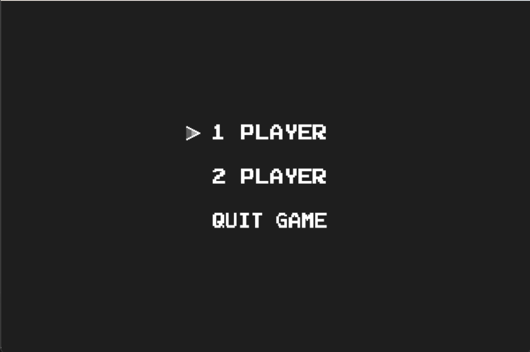
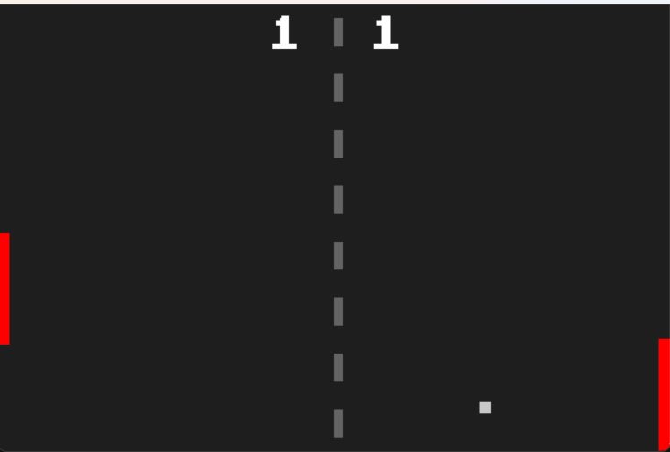

# 1. Ping Pong Game  HomePage

# 2. Gameplay

# 3. Controls 

1 Player Mode:

Use up arrow and down arrow keys to move the paddle up and down.

2 Player Mode:

Player 1: Use up arrow and down arrow keys to move the paddle up and down.  
Player 2: Use w key to move up and s key to move down.

# 4. Credits

**Nathan Robel**  
2024  
Using SDL2 to develop a classic Ping Pong game.

